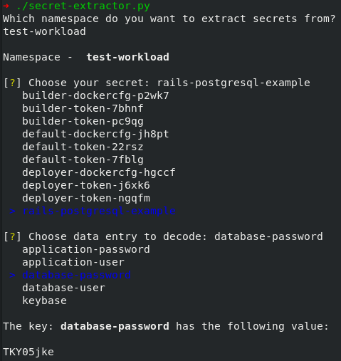

Secret extractor
=========
Simple script to extract the base64 encoded values from secrets in K8s/OCP.

How it works
----------------
When run, the script will prompt for a namespace where the secret exists in. It will then present a list of the secrets and thereafter a list of the data points to choose from. When choosen, it will base64 decode the value and print it out.

# Example usage